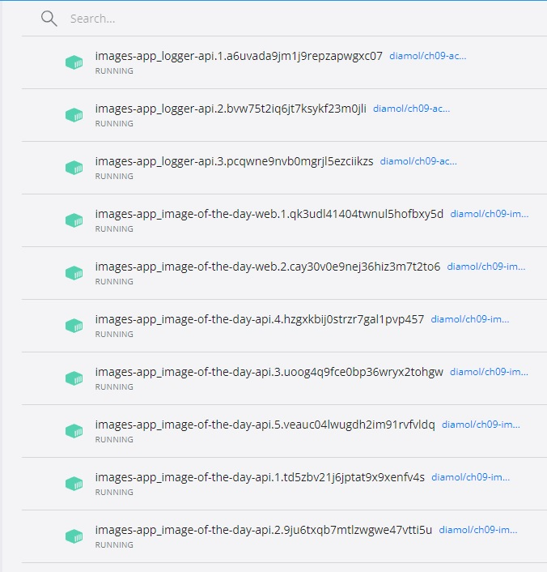
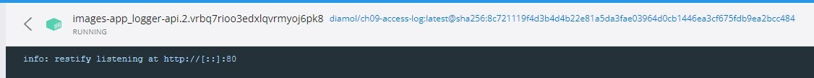
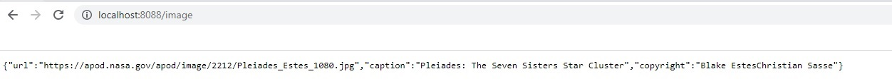
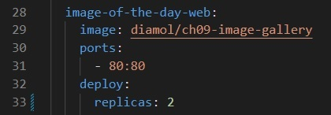

# Instrukcja
W folderze z plikiem run.ps1:
```sh
.\run.ps1
```
Usuwanie:
```sh
.\clean.ps1  
``` 

Polecenie z run.ps1:
```sh
docker stack deploy -c ./docker-compose.yml images-app
``` 

# Screenshot
#### Docker Desktop - po uruchomieniu widzimy działające kontenery

#### Kontener Access log 

#### Kontener API działający na porice 8088

#### Image gallery ustawiony na standardowym porcie HTTP 80

#### docker container ls
